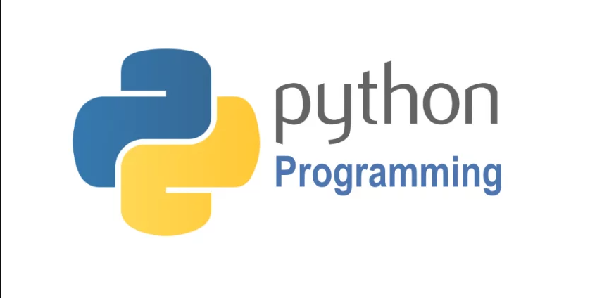

<!-- PROJECT LOGO -->

  

<!-- TABLE OF CONTENTS -->

  
Table of Contents

  <ol>
    <li>
      <a href="#about-the-project">About The Project</a>
    </li>
    <li>
      <a href="#topics-covered">Topics Covered</a>
    </li>
      <li>
      <a href="#completed-projects">Completed Projects</a>
    </li>
         <li>
      <a href="#resource">Resource</a>
    </li>
  </ol>

## About The Repository

This repository focuses on Python learning, inspired by the 'teclado' platform. It serves as an excellent starting point for individuals eager to delve into Python. Following the completion of this course, I now feel at ease with Python and possess the skills to address both beginner and intermediate-level challenges and subjects. The learning series spans 30 days, featuring daily practice exercises to reinforce my understanding.In total, I have successfully completed 12 simple projects, and the list of topics covered in this course is outlined below.

## Topics Covered

- Variables, loops, logic, and functions

- Work with data files for permanent storage

- Split your Python code into many files so it's easier to work with

- Comprehensions, lambda functions, and destructuring

- Learn about data analysis and web scraping

- Build a snake game using Python

## Completed Projects

* [A Simple Earnings Calculator](day-03/earnings_calculator.py)
* [Fizz Buzz](day-06/fizz_buzz.py)
* [Movie Budgets](day-07/movie_budget.py)
* [Credit Card Validator](day-09/credit_card_validator.py)
* [Reading List](day-12/reading_list.py)
* [Reading List with CSV](day-14/project/reading_list.py)
* [Reading List with CSV (Hard-version)](day-14/project/reading_list_hard.py)
* [JSON Reading List](day-18/project/reading_list.py)
* [Plotting Graphs](day-21/project_code/main.py)
* [Dice Roller](day-24/project/main.py)
* [Avocados](day-27/project/app.py)
* [Web Scraping](day-28/project/app.py)
* [Snake Game](day-30/project/app.py)

## Resource
[30 Days Of Python by Teclado](https://teclado.com/30-days-of-python/)
